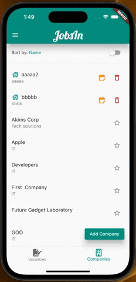
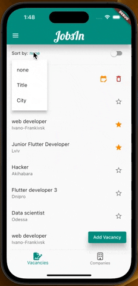
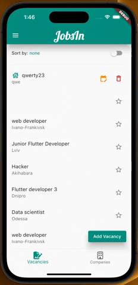
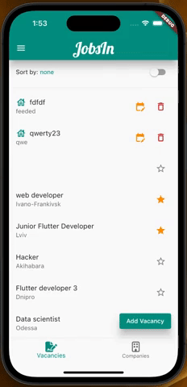
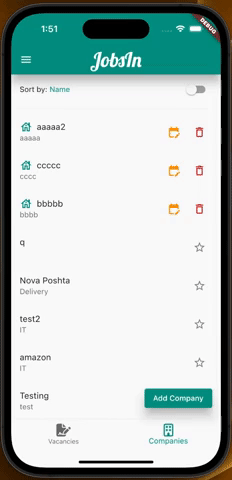

# Доброго часу доби), по перше хотів би подякувати за курс, привітати зі святами та побажати мирного неба.
    Стосовно роботи то я намагався зробити застосунок який відповідав би принципам Clean Architecture, це мій перший проект побудований спираючись на цей патерн, впродовж його створення паралельно проходив усілякі туторіали ,переписував , потім ще переписував и у підсумку здається з'явилося якесь розуміння. Якщо можна у якості фідбеку напишіть чи правильно все побудовано саме з точки зору архітектури( деякі недоліки та потенційно небезпечні місця коду я і сам бачу , просто не залишилось часу виправляти), також якщо буде час є декілька питань стосовно цього патерну.
* useCases це лише місток для перекидання даних з presentation до domain і ніякої логіки мати не повинні?

* Усі туторіали чи статі які я знаходив мали лише один repository , чи потрібно робити репозиторій на кожен entity як я зробив? чи він має бути один та цей один репозиторій має включати під репозиторій для Company та Vacancy? А можливо краще було зробити один репозиторій який повернув би Company з внутрішнім масивам Vacancy та працювати вже з цими даними? 

* Варіант з 2 ма репозиторіями як на мене виглядає краще, але коли нам треба відредагувати компанію ми згідно з api можем лише видалити стару та створити нову зі зміненими даними це призведе до зміни id компаній і не зрозуміло у якому місці редагувати companyId у вакансіях. чи буде допустимо створити helper classs у domain з доступом до обох репозитаріЇв  та з useCase викликати його метод? Або дати useCase доступ до обох репозитаріЇв та логіку зробити там? 

* Головну перевагу яку надає патерн це тестування, чи на практиці TDD маэ сенс? Чи все одно зручніше спочатку код потім тести?

* Здається невдалою ідеєю було використовувати Provider під clean architecture, бо філософія block(я з ним знайомий лише поверхнево) наче і створювалася під useCase , чи правильне в мене відчюття?

    
Add company

    

    
Add vacancy

    

    
Sort

    

    
Favorite

    

    
Show Detail

    

    
Edit

    

    
Delete

    

