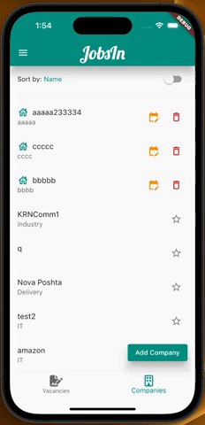

Створити застосунок який дозволяє створювати та передивлятись компанії та вакансії від них. Результат завантажити на github. У README.md описати перелік технологій, опис архітеутури та додати скріншоти.
Необхідний функціонал:

подивитись список вакансій.
При кліку на вакансію вона відкривається на окремому екрані.
подивитись список компаній. При кліку на компанію вона відкривається на окремому екрані. Також на цьому екрані відображаться список всіх вакансій цієї компанії.
можливість додати компанію.
можливість додати вакансію. При додаванні дати можливість обрати компанію зі списку.
За бажанням можна додати можливість сортування/фільтрування списків та додавання компаній/вакансій в локальний список обраного.

Опис API https://gist.github.com/akadatsky/cc743c2b60317be0b97e115b707181ac

    
Add company

    

    
Add vacancy

    

    
Sort

    

    
Favorite

    

    
Show Detail

    

    
Edit

    

    
Delete

    

